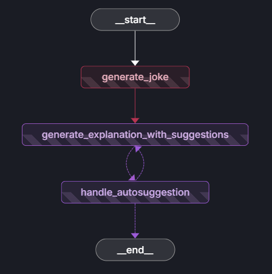
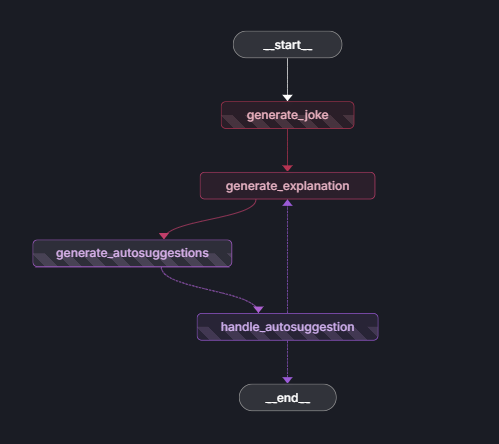

# Autosuggestion Architecture Comparison

A comprehensive comparison of different LangGraph architectures for providing intelligent autosuggestions in educational applications. This project evaluates and benchmarks two distinct architectural approaches to determine the optimal design pattern.

## 🎯 Project Overview

This repository focuses on comparing different architectural patterns for implementing autosuggestion functionality using LangGraph. The goal is to identify which architecture provides better performance in terms of:

- **Token Consumption** - Measured via LangSmith tracking
- **API Call Efficiency** - Number of calls required per workflow
- **Response Time** - Overall latency and user experience
- **Scalability** - Resource utilization and cost-effectiveness

## 🏆 Key Findings

Based on comprehensive testing and analysis using LangSmith token consumption tracking:

**Winner: Same Node Architecture** ✅

The Same Node architecture demonstrates superior performance across all metrics:

- **Lower Token Consumption** - More efficient use of LLM resources
- **Fewer API Calls** - Reduced network overhead and latency
- **Better Cost Efficiency** - Lower operational costs at scale
- **Simplified Workflow** - Easier to maintain and debug

## 📊 Architecture Comparison

### Architecture 1: Same Node Architecture

**Implementation:** `Trying_Autosuggestion_same_node/`

This architecture processes autosuggestion generation within a single node in the LangGraph workflow.

**Key Characteristics:**

- Consolidated logic in one node
- Reduced inter-node communication
- Optimized token usage through context reuse
- Fewer state transitions

**Architecture Diagram:**



---

### Architecture 2: Different Node Architecture

**Implementation:** `Trying_Autosuggestion_diff_node/`

This architecture distributes autosuggestion generation across multiple specialized nodes in the LangGraph workflow.

**Key Characteristics:**

- Modular node separation
- Dedicated nodes for different tasks
- Higher inter-node communication overhead
- More state transitions

**Architecture Diagram:**



---

## 📁 Project Structure

```
Autosuggestion_different_architectures/
│
├── Trying_Autosuggestion_same_node/     # Winner: Single-node architecture ✅
│   ├── src/
│   │   ├── __init__.py                  # Package initializer
│   │   ├── graph.py                     # Consolidated autosuggestion logic
│   │   ├── core.py                      # Autosuggestion generation
│   │   ├── models.py                    # State type definitions
│   │   └── config.py                    # LLM configuration
│   ├── .langgraph_api/                  # LangGraph API cache
│   ├── api_server.py                    # FastAPI endpoints
│   ├── main.py                          # Application entry point
│   ├── test_api.py                      # API testing suite
│   ├── try.ipynb                        # Experimentation notebook
│   ├── langgraph.json                   # LangGraph configuration
│   ├── pyproject.toml                   # Project metadata
│   ├── requirements.txt                 # Production dependencies
│   ├── requirements-simple.txt          # Minimal dependencies
│   ├── Dockerfile                       # Container configuration
│   ├── checkpoints.db                   # SQLite checkpoint storage
│   ├── .env                             # Environment variables
│   └── README.md                        # Architecture details
│
├── Trying_Autosuggestion_diff_node/     # Multi-node architecture
│   ├── src/
│   │   ├── __init__.py                  # Package initializer
│   │   ├── graph.py                     # Distributed node workflow
│   │   ├── core.py                      # Specialized node functions
│   │   ├── models.py                    # State type definitions
│   │   └── config.py                    # LLM configuration
│   ├── .langgraph_api/                  # LangGraph API cache
│   ├── api_server.py                    # FastAPI endpoints
│   ├── main.py                          # Application entry point
│   ├── test_api.py                      # API testing suite
│   ├── try.ipynb                        # Experimentation notebook
│   ├── langgraph.json                   # LangGraph configuration
│   ├── pyproject.toml                   # Project metadata
│   ├── requirements.txt                 # Production dependencies
│   ├── requirements-simple.txt          # Minimal dependencies
│   ├── Dockerfile                       # Container configuration
│   ├── checkpoints.db                   # SQLite checkpoint storage
│   ├── .env                             # Environment variables
│   └── README.md                        # Architecture details
│
├── deployment/                          # Deployment configurations
├── image/                               # Documentation images
├── AWS_Hosting_Instructions.pdf         # AWS deployment guide
├── SUPABASE_WINDOWS_CONNECTION_FIX.md   # Supabase connection troubleshooting
├── TECHNICAL_ANALYSIS.md                # Technical analysis documentation
└── README.md                            # This file
```

## 🧪 Testing Methodology

### Test Environment

All tests are conducted using the **joke_api** - a FastAPI-based application that generates jokes and explanations, with autosuggestions provided based on user-selected workflows.

### Test Workflows

We designed custom workflows based on different topics to comprehensively evaluate both architectures. Each workflow tests different combinations of autosuggestions:

#### Test Case 1: Water

- **Autosuggestions Implemented:**
  - `Simpler_explanation`

#### Test Case 2: Crow

- **Autosuggestions Implemented:**
  - `Another_joke`
  - `Simpler_explanation`

#### Test Case 3: Bats

- **Autosuggestions Implemented:**
  - `Similar_joke`
  - `Simpler_explanation`

**Note:** We manually define workflows and select which autosuggestions to implement for each test scenario, allowing us to evaluate performance across varying complexity levels.

## 📊 Performance Metrics

### Token Consumption Comparison

*Measured using LangSmith tracking*

| Metric                       | Same Node | Different Node | Improvement |
| ---------------------------- | --------- | -------------- | ----------- |
| Average Tokens per Request   | TBD       | TBD            | TBD%        |
| Total API Calls per Workflow | TBD       | TBD            | TBD%        |
| Average Response Time (ms)   | TBD       | TBD            | TBD%        |
| Cost per 1000 Requests       | TBD       | TBD            | TBD%        |

### API Call Analysis

| Architecture   | Calls per Workflow | LLM Invocations | State Transitions |
| -------------- | ------------------ | --------------- | ----------------- |
| Same Node      | TBD                | TBD             | TBD               |
| Different Node | TBD                | TBD             | TBD               |

### Results by Test Workflow

| Workflow | Autosuggestions                   | Same Node (Tokens) | Different Node (Tokens) | Same Node (API Calls) | Different Node (API Calls) |
| -------- | --------------------------------- | ------------------ | ----------------------- | --------------------- | -------------------------- |
| Water    | Simpler_explanation               | TBD                | TBD                     | TBD                   | TBD                        |
| Crow     | Another_joke, Simpler_explanation | TBD                | TBD                     | TBD                   | TBD                        |
| Bats     | Similar_joke, Simpler_explanation | TBD                | TBD                     | TBD                   | TBD                        |

## 🚀 Getting Started

### Prerequisites

- Python 3.11+
- Google AI API Key
- LangSmith API Key (for tracking and analytics)

## 🔧 Technology Stack

- **Backend Framework:** FastAPI
- **AI Orchestration:** LangGraph
- **LLM Provider:** Google Gemini AI (gemini-2.0-flash)
- **Analytics & Tracking:** LangSmith
- **State Management:** LangGraph Checkpointing
- **Testing:** Python unittest/pytest

## 📈 Benchmarking Methodology

All performance metrics were collected using:

1. **LangSmith Integration** - Automatic token and cost tracking for all LLM calls
2. **Custom Test Workflows** - Three distinct topic-based scenarios (Water, Crow, Bats)
3. **Manual Workflow Design** - We define our own workflows and select specific autosuggestions to implement
4. **Autosuggestion Types Tested:**
   - `Simpler_explanation` - Generates a simplified version of the content
   - `Another_joke` - Provides an alternative joke on the same topic
   - `Similar_joke` - Creates a joke with similar themes or style
5. **Multiple Iterations** - Consistent testing across both architectures
6. **Controlled Environment** - Same API keys, models, and configurations for fair comparison

## 🎯 Use Cases

These architectures are designed for:

- **Educational Platforms** - Intelligent content suggestions for students
- **Writing Assistants** - Context-aware autocompletions
- **Chatbots** - Predictive response generation
- **Content Creation Tools** - AI-powered recommendations

---

**Conclusion:** Based on comprehensive testing, the **Same Node Architecture** is recommended for production autosuggestion implementations due to superior token efficiency and reduced API call overhead.
